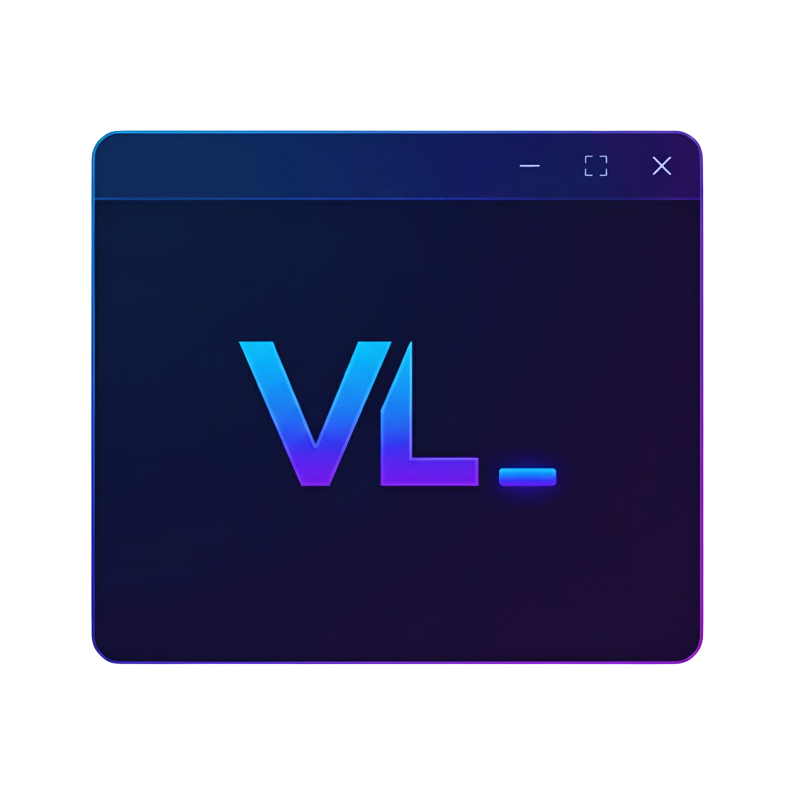
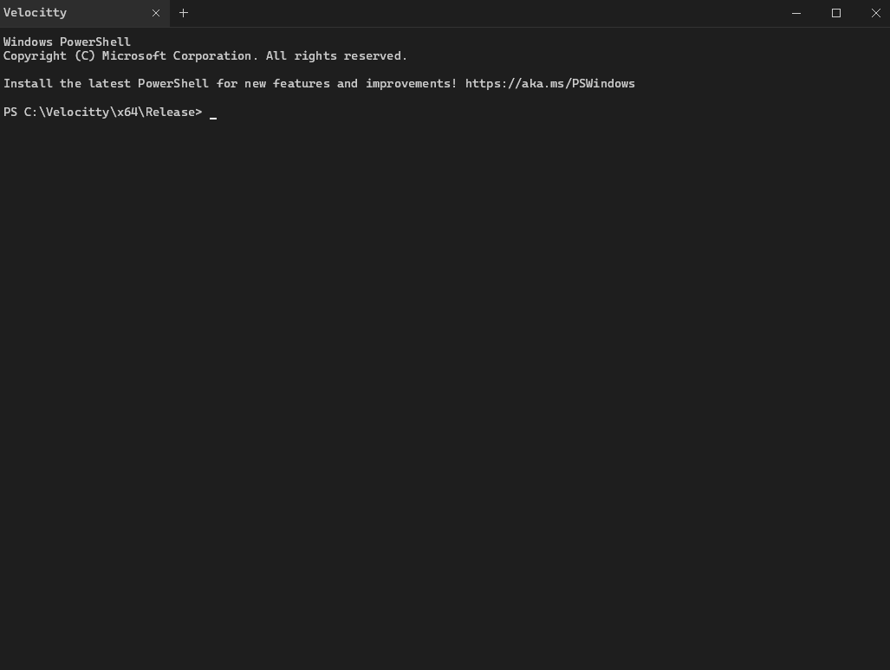

<p align="center">
    
</p>

<h1 align="center">Velocitty - A GPU-accelerated terminal emulator for Windows</h1>

<p align="center">
  
</p>

## About

Velocitty is a modern, GPU-accelerated terminal emulator for Windows built with DirectX 11 and DirectWrite. It features hardware-accelerated rendering, a native Windows pseudo-console (ConPTY) backend, and a rich set of features including tabbed interfaces, pane splitting, Sixel graphics, and instant file search.

Designed for performance and aesthetics, Velocitty delivers smooth rendering with ligature support, a custom Windows 11-style titlebar, and extensive terminal emulation capabilities.

**Platform:** Windows 10 version 1809 or later

## Features

### Terminal Emulation
- **Full VT100/ANSI support** - Complete escape sequence processing (CSI, OSC, DCS)
- **Windows ConPTY backend** - Native pseudo-terminal interface for maximum compatibility
- **UTF-8/UTF-32 support** - Full Unicode support including emoji and CJK characters
- **Scrollback history** - Configurable history buffer (default 10,000 lines)
- **Hyperlink support** - OSC 8 hyperlink protocol for clickable links

### Rendering
- **DirectX 11 GPU acceleration** - Hardware-accelerated rendering pipeline
- **DirectWrite text rendering** - High-quality subpixel font rendering
- **Ligature support** - OpenType ligature rendering via text shaping
- **Glyph atlas caching** - Efficient texture atlas for font glyphs
- **Box drawing characters** - Full Unicode box drawing support (U+2500-U+257F)
- **Powerline glyphs** - Built-in support for statusline symbols
- **Braille patterns** - Accessibility support for braille characters
- **VSync support** - Smooth, tear-free rendering

### Sixel Graphics
- **Full Sixel protocol** - DEC terminal graphics support
- **Image atlas** - GPU-optimized image caching and rendering
- **Dynamic color palettes** - Sixel color definition support

### Window Management
- **Tabbed interface** - Multiple independent terminal tabs
- **Pane splitting** - Horizontal and vertical splits with recursive nesting
- **Custom titlebar** - Windows 11-style integrated titlebar with tabs
- **Dark mode** - Native Windows dark mode integration

### File Search
- **Instant file search** - Background disk indexing with trigram-based search
- **MFT enumeration** - Fast Master File Table scanning for rapid indexing
- **Real-time results** - Threaded search with live result updates
- **Quick actions** - Change directory, open file, or insert path

### Input & Selection
- **Full keyboard support** - Function keys, modifiers, and special keys
- **Mouse support** - Click tracking, wheel scrolling, and selection
- **Word selection** - Double-click to select words
- **Rectangular selection** - Block selection mode
- **Clipboard integration** - Native Windows clipboard support

### Customization
- **Configurable colors** - Full 256-color and true color support
- **Font configuration** - Family, size, and variant options
- **Key bindings** - Customizable keyboard shortcuts
- **Cursor styles** - Block cursor with configurable blink rate

## Requirements

- Windows 10 version 1809 or later (ConPTY support required)
- DirectX 11 compatible GPU
- Visual C++ Redistributable 2022

## Installation

### From Releases

Download the latest release from the [GitHub releases page](https://github.com/voidwarestudios/velocitty/releases).

### Building from Source

#### Prerequisites

- Visual Studio 2022 with C++ desktop development workload
- Windows 10 SDK (10.0.19041.0 or later)

#### Build Steps

1. Clone the repository:
   ```
   git clone https://github.com/voidwarestudios/velocitty.git
   cd velocitty
   ```

2. Open `Velocitty.sln` in Visual Studio 2022

3. Select your configuration (Debug/Release) and platform (x64)

4. Build the solution (Ctrl+Shift+B)

The output binary will be in `x64/Release/Velocitty.exe` or `x64/Debug/Velocitty.exe`.

#### Command Line Build

```
msbuild Velocitty.sln /p:Configuration=Release /p:Platform=x64
```

## Configuration

Velocitty stores its configuration in:

```
%APPDATA%\Velocitty\config.json
```

### Configuration Options

```json
{
  "colors": {
    "foreground": "#E0E0E0",
    "background": "#1A1A2E",
    "cursor": "#E94560",
    "selection": "#E94560",
    "palette": ["#1A1A2E", "#E94560", "#0F3460", ...]
  },
  "font": {
    "family": "Cascadia Mono",
    "size": 14.0,
    "ligatures": true
  },
  "terminal": {
    "scrollbackLines": 10000,
    "cursorBlink": true,
    "cursorBlinkRate": 530
  },
  "window": {
    "width": 1280,
    "height": 720,
    "opacity": 1.0
  },
  "rendering": {
    "vsync": true
  }
}
```

## Keyboard Shortcuts

| Action | Shortcut |
|--------|----------|
| New Tab | `Ctrl+T` |
| Close Tab | `Ctrl+W` |
| Close Pane | `Ctrl+Alt+W` |
| Next Tab | `Ctrl+Tab` |
| Previous Tab | `Ctrl+Shift+Tab` |
| Split Horizontal | `Ctrl+Alt+D` |
| Split Vertical | `Ctrl+Shift+D` |
| Copy | `Ctrl+C` (with selection) |
| Paste | `Ctrl+V` |
| File Search | `Ctrl+Shift+F` |
| Zoom In | `Ctrl++` |
| Zoom Out | `Ctrl+-` |
| Reset Zoom | `Ctrl+0` |
| Fullscreen | `F11` |
| Scroll Up | `Ctrl+Up` |
| Scroll Down | `Ctrl+Down` |
| Scroll Page Up | `Ctrl+PgUp` |
| Scroll Page Down | `Ctrl+PgDn` |
| Scroll to Top | `Ctrl+Home` |
| Scroll to Bottom | `Ctrl+End` |

## Built-in Commands

Velocitty includes built-in commands that can be typed directly into the terminal:

| Command | Description |
|---------|-------------|
| `vlfind` | Open the file search overlay |
| `vlctx` | Toggle Windows Explorer context menu integration |

## Windows Explorer Integration

Velocitty can add an "Open in Velocitty" option to the Windows Explorer context menu. To enable:

1. Type `vlctx` in the terminal and press Enter
2. The context menu integration will be toggled on/off

This adds a right-click option on folders and directory backgrounds to open Velocitty at that location.

## Architecture

Velocitty is built with a modular architecture:

```
src/
├── core/           Terminal engine & data structures
│   ├── Terminal    VT100 parser and escape sequences
│   ├── ScreenBuffer    Circular buffer with scrollback
│   ├── Cell        Character cell with attributes
│   └── Selection   Text selection and clipboard
├── pty/            Pseudo-terminal management
│   └── ConPty      Windows ConPTY wrapper
├── render/         DirectX 11 rendering
│   ├── DxRenderer  GPU rendering pipeline
│   ├── GlyphAtlas  Font texture atlas
│   ├── ImageAtlas  Sixel image atlas
│   └── Shaders     HLSL vertex/pixel shaders
├── config/         Configuration management
├── ui/             UI elements
│   ├── Titlebar    Custom window frame
│   ├── TabManager  Tab management
│   ├── Pane        Terminal pane
│   └── FileSearchOverlay   Search UI
└── search/         File search service
    ├── FileSearchService   Background indexing
    ├── DiskIndex   File database
    └── TrigramIndex    Fast pattern matching
```

## FAQ

**Why another terminal emulator?**

Velocitty was built to provide a fast, modern terminal experience on Windows with features like GPU-accelerated rendering, Sixel graphics, and instant file search that aren't commonly found together in other Windows terminal emulators.

**Why Windows only?**

Velocitty is built specifically for Windows, leveraging DirectX 11, DirectWrite, and ConPTY for the best possible Windows experience. Cross-platform support would require significant architectural changes and potentially compromise the native Windows integration.

**How does the file search work?**

Velocitty indexes your drives in the background using Windows MFT (Master File Table) enumeration for speed. It builds a trigram index that enables fast fuzzy matching. The indexing runs in a separate thread and doesn't impact terminal performance.

**Does it support WSL?**

Yes! Velocitty works with WSL through the ConPTY interface. Simply run `wsl` or your preferred distribution command.

**Can I use custom fonts?**

Yes, any font installed on your system can be used. Monospace fonts are recommended. Configure the font family in the config file or through the settings.

## Contributing

Contributions are welcome! Please feel free to submit issues and pull requests.

1. Fork the repository
2. Create your feature branch (`git checkout -b feature/amazing-feature`)
3. Commit your changes (`git commit -m 'Add some amazing feature'`)
4. Push to the branch (`git push origin feature/amazing-feature`)
5. Open a Pull Request

## License

This project is licensed under the [CC BY-NC 4.0](https://creativecommons.org/licenses/by-nc/4.0/) (Creative Commons Attribution-NonCommercial 4.0 International License). See the [LICENSE](LICENSE) file for details.

**You may not use this software for commercial purposes.**

## Acknowledgments

- [DirectWrite](https://docs.microsoft.com/en-us/windows/win32/directwrite/direct-write-portal) for text rendering
- [ConPTY](https://devblogs.microsoft.com/commandline/windows-command-line-introducing-the-windows-pseudo-console-conpty/) for pseudo-terminal support
- [Cascadia Code](https://github.com/microsoft/cascadia-code) for the default font
